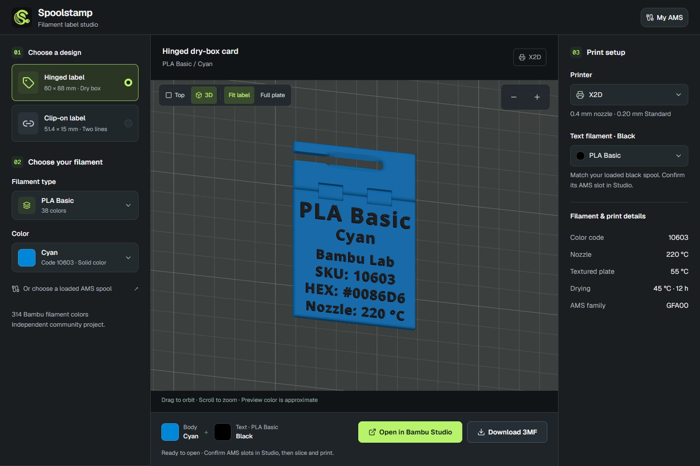
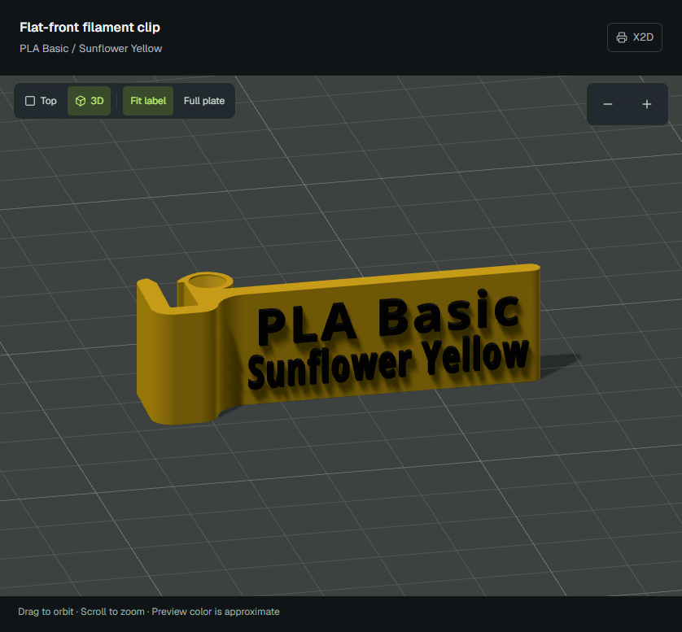
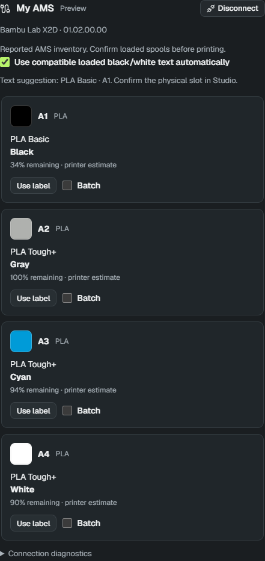

# Spoolstamp


Create 3D-printable filament labels in a few clicks. Pick a design, choose your filament, and preview your label before opening it in Bambu Studio.

**[Open Spoolstamp →](https://spoolstamp.bourhan.org/)** — use it in your browser, no installation needed.



## Features

- **Two label designs** — a hinged dry-box label and a flat-front clip-on label.
- **Bambu Lab filament catalog** — 314 colors with searchable material types, color names, and codes.
- **Live 3D preview** — rotate, zoom, and switch between a label close-up and your printer's build plate.
- **Automatic lettering** — filament details filled in for you, with contrasting black or white text.
- **Printer profiles** — 14 Bambu Lab models with matching bed dimensions and export settings.
- **Color-aware 3MF export** — separate body and text filament profiles, ready to open and slice in Bambu Studio.
- **My AMS** — when running locally, choose loaded spools, suggest compatible text filament, and batch-export labels.
- **One-click Studio opening** — available when running locally alongside Bambu Studio.
- **Responsive workspace** — designed for desktop, tablet, and phone.

## Clip-on labels

A flat face with two lines: material type and color.



## My AMS

Pick from your loaded spools and batch-create labels without looking up each filament.



## Run locally

Requires Node.js 22.13 or newer.

```sh
git clone https://github.com/byassin/spoolstamp.git
cd spoolstamp
npm ci
npm run dev
```

Open `http://localhost:3000`.

## Documentation

[Hosting](docs/hosting.md) · [My AMS](docs/ams-integration.md) · [Bambu Studio](docs/local-studio-handoff.md) · [Development](CONTRIBUTING.md) · [Architecture](docs/architecture.md)

## License

Application code: [MIT](LICENSE). Data, model, and font notices: [NOTICE-DATA.md](NOTICE-DATA.md).

Spoolstamp is an independent project, not affiliated with Bambu Lab.
