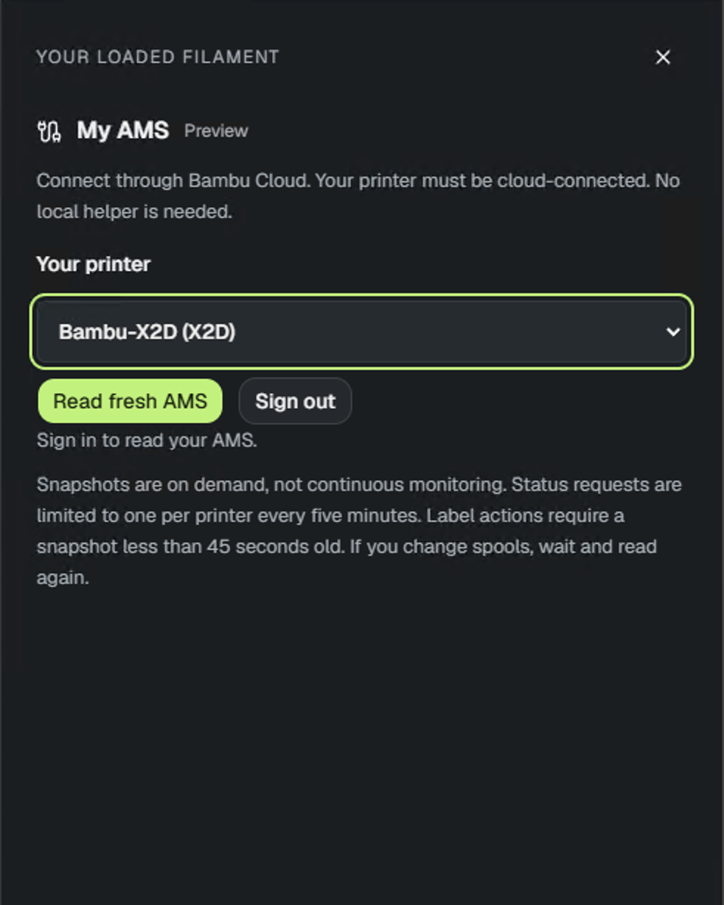
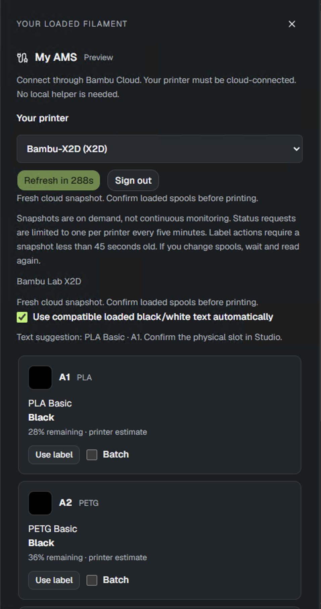

# My AMS

Use the spools loaded in your printer to create labels through the Bambu Cloud
preview on [Spoolstamp](https://spoolstamp.bourhan.org/). The browser interface and
cloud backend are live, with a successful real X2D sign-in and fresh snapshot.
Sign-in is currently restricted to the approved preview account; the manual
filament picker remains available to everyone. The LAN connection and saved-printer
controls have been removed.

## Connect

1. Open **My AMS → Connect Bambu Cloud** on the live website.
2. Enter your global-region Bambu email and accept the connection notice.
3. Click **Send verification email**, then enter the six-digit code.
4. Choose a cloud-connected printer from your account and click **Read fresh AMS**.
5. Confirm the loaded spools and select **Use label**.

No local helper, printer IP, LAN access code, or account password is requested.
The backend holds your email/token temporarily encrypted; the token is never
saved in the browser and verification codes are not persisted. **Privacy details**
in the sign-in form explains this handling. Sign out deletes the session. Sessions
expire after 30 minutes; expired encrypted records can remain for days until
cleanup. Restarting the hosted backend does not sign you out. The separate local
development preview keeps sessions in memory and clears them on restart.

Reads are on demand: one per account/printer every five minutes. Label actions
require a complete snapshot under 45 seconds old. After changing spools, wait
and read again; old cached identities are not treated as current inventory.
Remaining percentages are printer estimates, not measured spool weights.

## Live X2D browser test

Owner-provided screenshots from October 8, 2026 show successful sign-in, selection
of **Bambu-X2D (X2D)**, and a fresh cloud snapshot. The visible slots are A1
**PLA Basic / Black / 28%** and A2 **PETG Basic / Black / 36%**.

This verifies the hosted sign-in/read path for this printer and account, not every
model or a public rollout. The crop does not show A3/A4. Actual label selection,
batch downloads, expiry, stale-action disabling, logout during reads, multi-AMS,
and use with the development computer off still need separate real-device checks.

## Text and batches

**Use compatible loaded black/white text automatically** suggests a contrasting
spool from the same material family. Text filament can also be chosen manually.
Select up to eight spools to download separate 3MF labels together as a ZIP,
using the current design and printer profile. Bambu Studio assigns final AMS
slots when printing. Ambiguous products require confirmation, not guessing.

## Legacy saved credentials

The removed LAN feature's saved pairing files are not read, migrated, or deleted.
Existing local credential files remain untouched outside this repository.
No credentials are copied into the new cloud service.

## Setup and qualification

See [Hosted cloud AMS preview](hosted-cloud-ams.md) for local development of the
hosted flow, deployment wiring, security boundaries, and remaining qualification.
The [isolated cloud probe](cloud-ams-prototype.md) remains a developer tool.
