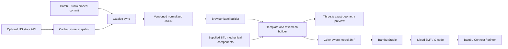

# Architecture

## Catalog boundary

BambuStudio is the canonical source for color identities, print profiles, printer models, and drying data. The sync pins the upstream commit, recursively resolves profile inheritance, writes normalized data, and records source hashes.

The storefront service is optional. It enriches matching five-digit color codes with US store product and SKU details, but it is never called during normal app use and a failed refresh must not erase the last good catalog.

## Geometry boundary

Templates produce semantic meshes for structural parts and raised text. The dry-box card retains supplied geometry; the filament clip caps the pocket of a supplied STL. The same mesh arrays drive the WebGL preview and 3MF package. Gradient and split-color profile stops remain appearance metadata for one physical body spool; they are not extra AMS materials.

The primary dry-box source asset retains four mechanical components from the supplied STL: 226,476 triangles with exact Float32 coordinates. Its original lettering and six zero-thickness opposing source faces are discarded. `lib/hinge-clearance.ts` applies the minimal `bearing-relief-0.075mm-v2` revision to the two moving links: spherical sockets grow and spherical pins shrink by 0.075 mm radially (0.025 mm more than R1). Source geometry is kept separately; fixed card/hook vertices, topology, link bed contact and overall bounds are unchanged. The revision is applied once on template load, shared by preview and export, and recorded in the 3MF manifest and filename. Mechanical serialization retains exact Float32 coordinates; only new text uses five-decimal quantization. Tests verify source hashes, relief limits, material removal, single-solid links, and serialized topology. See [the extraction and verification record](supplied-drybox.md).

Raised lettering uses Noto Sans Bold outlines under the SIL Open Font License. The contours are converted to robust manifold extrusions; hard-edge preview normals are split without changing geometry.

The clip has exactly two vector-text rows. It allows bounded horizontal condensation, rechecks strokes after 0.0001 mm contour simplification, and shortens selected long/redundant names only when the full name fails the 0.45 mm extrusion-width screen. Full source names remain in the UI and export metadata. Text is rotated onto the original -Y-facing label surface. Both designs retain their source print orientation in the preview and export, opening in a gently tilted front-left view. The preview bed uses the selected printer's pinned profile dimensions, with 10 mm grid spacing, shaded single-nozzle strips and keep-out areas. Bed sheet styling is illustrative; printable boundaries and common-nozzle placement share the export calculation. The camera fits the whole plate; top view and bounded zoom remain available. Filament changes preserve the camera; printer changes rebuild and refit the bed without regenerating model meshes. Preview plate geometry is never exported. See [clip checks](clip-label.md).

The 3MF uses Core and Materials namespaces, millimeter units, a color group, semantic mesh parts, per-part extruder metadata, a Bambu project configuration and a generator manifest. A pinned snapshot resolves compatible system presets for each printer/product pair. Two filament slots carry body and contrasting text colors; gradient stops do not create extra spools. The required BambuStudio-prefixed `Application` compatibility identifier includes `+FilamentLabelLab.0.1.0`; standard creator and explicit generator metadata retain actual provenance. See [the exact importer gate and native verification](studio-project.md).

## Printer boundary

A development-only Vite middleware supports local Bambu Studio handoff without a companion app or remote storage. The browser stages its generated bytes over same-origin loopback HTTP, then exposes a user-clicked Studio protocol link to the temporary token-addressed 3MF. All transfer state is bounded and memory-only, and the middleware is absent from production builds. See [local handoff and validation](local-studio-handoff.md).

A printer selection resolves its actual system printer/process/filament preset IDs for a 0.4 mm nozzle. Studio's desktop importer hydrates their installed settings; machine G-code is not copied into the website's export. Users must open as a project, have these presets installed, map physical spools and slice. Native CLI import/re-export verifies assignment retention, not desktop preset hydration or printing. Direct CLI slicing needs complete external settings; this sparse project is intended for opening in the desktop slicer.

The export translates the complete build instance to the center of the common nozzle-printable area and onto Z=0. A 10 mm clearance check protects bed edges and excluded zones; unsupported or unsafe layouts fail explicitly. The translation never changes cached/source mesh vertices. Native verification reconstructs world coordinates after Studio re-export so a successful import cannot hide an origin-placement regression.

The planned local companion will:

1. receive the generated model locally;
2. resolve complete machine, process, and filament configs;
3. invoke an independently installed Bambu Studio CLI;
4. confirm the output is actually sliced; and
5. hand the result to Bambu Connect.

The hosted app will not emulate Bambu's private cloud client or collect printer credentials.
